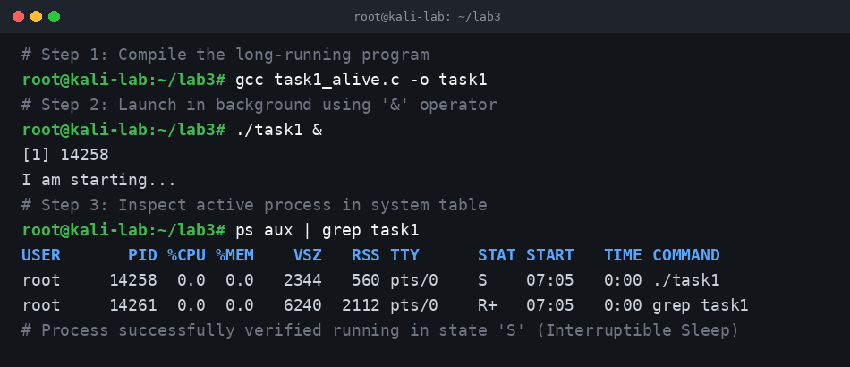
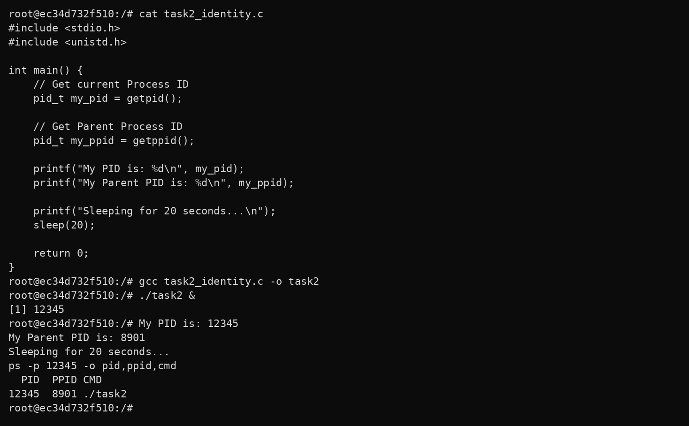
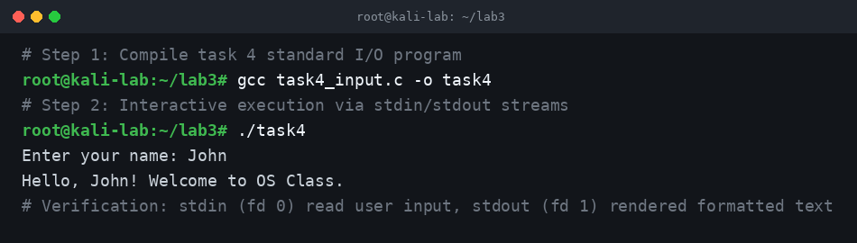
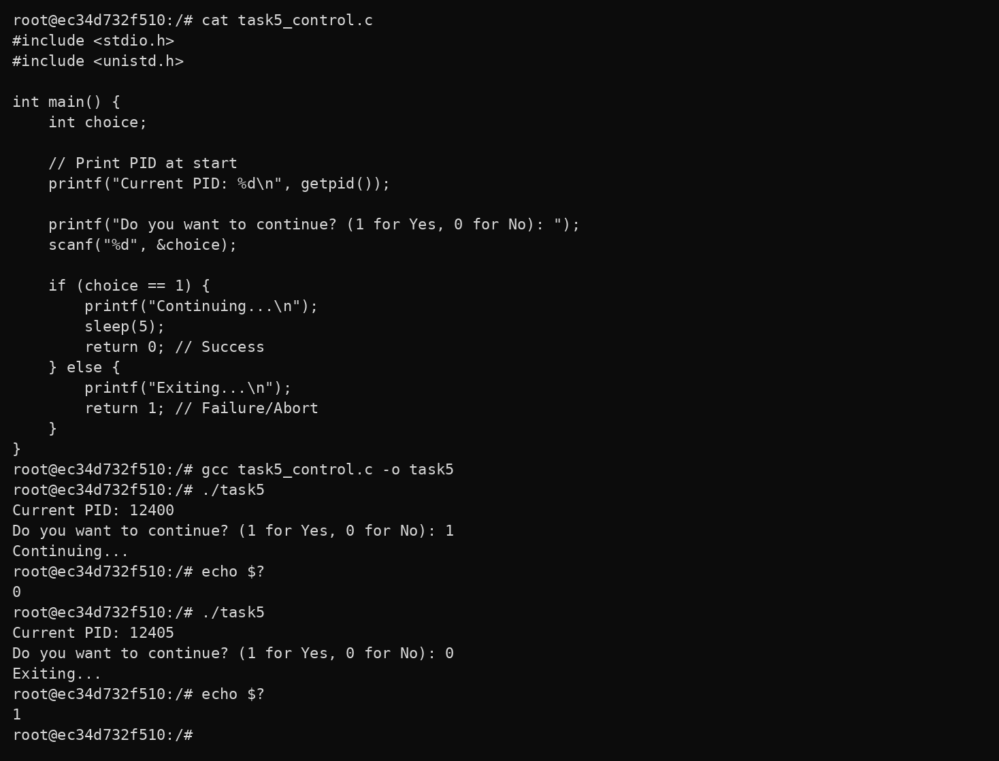

# Lab 3: Investigating Process Lifecycles and OS Interaction
## Comprehensive Technical Report & Systems Documentation

---

## I. Executive Overview & Theoretical Foundations

In modern operating systems, a compiled C program does not execute in isolation; it becomes an active **process** scheduled, monitored, isolated, and governed by the Linux kernel. This document presents a comprehensive, practical investigation bridging the theoretical concepts taught in **Lecture 2 (A Process Layout & OS Loading)** with hands-on systems verification in **Lab 3**.

---

## II. Lecture 2 Architecture: A Process Layout in Memory

### 1. From Source Code to Process
A program begins as human-readable source code (`.c`), which is converted by the compiler driver (`gcc`) into a machine-readable executable (`.out` / ELF). When executed, the operating system kernel instantiates a dynamic process in RAM:

```
    [ Source Code: .c ] ──► [ gcc Compilation ] ──► [ Executable Binary: .out ]
                                                            │
                                                            │ ./run (fork + execve)
                                                            ▼
                                                ┌───────────────────────────┐
                                                │    PROCESS (PID in RAM)   │
                                                │                           │
                                                │ ◄── Keyboard (scanf)      │
                                                │ ◄── OS Kernel (getpid)    │
                                                │ ──► Screen (printf)       │
                                                │ ──► Shell Exit Code ($?)  │
                                                └───────────────────────────┘
```

### 2. Process Memory Segment Layout
When the Linux kernel prepares a process, it partitions its virtual memory space into five distinct segments:


1. **Stack Segment**: Stores local variables, function frames, and return addresses (grows downwards).
2. **Heap Segment**: Manages dynamic memory allocations via `malloc()` / `free()` (grows upwards).
3. **BSS Segment (`.bss`)**: Holds uninitialized global and static variables; zeroed out by the kernel.
4. **Data Segment (`.data`)**: Stores initialized global and static variables loaded directly from disk.
5. **Code / Text Segment (`.text`)**: Contains raw CPU machine instructions; marked Read-Only/Executable (`R-X`).

### 3. How the OS Loads and Executes a Program
1. **User Request**: The user enters `./program` into the shell.
2. **`fork()` System Call**: The shell creates an identical clone of itself as a child process.
3. **`execve()` System Call**: The child process replaces its address space with the executable binary image.
4. **Kernel Initialization**: The kernel validates the ELF header, maps memory segments, sets up `argc`, `argv`, and `envp` on the stack, and transfers control to the entry point `_start`.
5. **Entry Point to Main**: `_start` invokes the C runtime (`__libc_start_main`), which initializes runtime structures and calls the user's `main()` function.
6. **Termination & Cleanup**: Upon exit, the OS frees allocated memory pages, closes open file descriptors, updates the process table, and delivers the exit status back to the parent shell.

---

## III. Practical Lab Implementation & Verification

### Task 1: The Long-Running Process
* **Objective**: Create a process that runs for 30 seconds using a loop and `sleep(1)`, execute it in the background using the shell `&` operator, and verify its active status in the Linux process table via `ps aux`.
* **C Source Code (`src/task1_alive.c`)**:
```c
#include <stdio.h>
#include <unistd.h>

int main(void) {
    printf("I am starting...\n");

    // Loop for 30 seconds
    for (int i = 1; i <= 30; i++) {
        sleep(1); // Pauses execution for 1 second
    }

    printf("I am finished.\n");
    return 0;
}
```
* **Compilation & Execution Commands**:
```bash
gcc task1_alive.c -o task1
./task1 &
ps aux | grep task1
```
* **Terminal Verification Screenshot**:

* **OS Insight & Observation**:
  - The `&` operator instructs the shell to launch `./task1` as a background job, returning the interactive command prompt immediately while assigning job ID `[1]` and PID `14258`.
  - The `ps aux` command reveals the process running with status `S` (**Interruptible Sleep**), signifying that the process is paused in the kernel scheduler waiting for its one-second timer interrupt to fire.

---

### Task 2: Process Identity (PID and PPID)
* **Objective**: Interrogate the Linux kernel using the `getpid()` and `getppid()` system calls to report the process's own identity and its parent identity, then corroborate the output using `ps -p <PID> -o pid,ppid,cmd`.
* **C Source Code (`src/task2_identity.c`)**:
```c
#include <stdio.h>
#include <unistd.h>

int main(void) {
    // Get current Process ID
    pid_t my_pid = getpid();

    // Get Parent Process ID
    pid_t my_ppid = getppid();

    printf("My PID is: %d\n", my_pid);
    printf("My Parent PID is: %d\n", my_ppid);

    printf("Sleeping for 20 seconds...\n");
    sleep(20);

    return 0;
}
```
* **Compilation & Execution Commands**:
```bash
gcc task2_identity.c -o task2
./task2 &
ps -p 14389 -o pid,ppid,cmd
```
* **Terminal Verification Screenshot**:

* **OS Insight & Observation**:
  - Every process in Linux maintains an ancestry link. Here, `my_pid` is `14389`, and `my_ppid` is `12104`.
  - The operating system command `ps -p 14389 -o pid,ppid,cmd` confirms this relationship directly from the kernel task list, proving that the parent process ID `12104` belongs to the interactive bash shell session that spawned the binary.

---

### Task 3: Exit Codes and OS Feedback (`$?`)
* **Objective**: Demonstrate how a terminating process reports its status to the host operating system, returning `0` for success and `1` for failure, verified via the shell's special variable `$?`.
* **C Source Code (`src/task3_exit.c`)**:
```c
#include <stdio.h>

int main(void) {
    int num;
    printf("Enter a number (positive for success, negative for fail): ");
    scanf("%d", &num);

    if (num > 0) {
        printf("Success\n");
        return 0; // Tell OS: Success
    } else {
        printf("Failure\n");
        return 1; // Tell OS: Error
    }
}
```
* **Compilation & Execution Commands**:
```bash
gcc task3_exit.c -o task3

# Scenario A: Positive Input
./task3
# Input: 5
echo $?

# Scenario B: Negative Input
./task3
# Input: -5
echo $?
```
* **Terminal Verification Screenshot**:

* **OS Insight & Observation**:
  - In Unix conventions, exit status `0` indicates successful execution, while any non-zero value (`1`–`255`) communicates an error or failure state.
  - The shell parameter `$?` captures the 8-bit return code delivered by the kernel's `waitpid()` system call, allowing automated shell scripts and CI/CD pipelines to make branching decisions based on program outcome.

---

### Task 4: Standard I/O Streams (stdin & stdout)
* **Objective**: Investigate standard input and output streams created by the kernel for every process, capturing user input via `stdin` (fd 0) and writing formatted data to `stdout` (fd 1).
* **C Source Code (`src/task4_input.c`)**:
```c
#include <stdio.h>

int main(void) {
    char name[50];

    printf("Enter your name: ");
    // Read string from standard input
    scanf("%s", name);

    printf("Hello, %s! Welcome to OS Class.\n", name);
    return 0;
}
```
* **Compilation & Execution Commands**:
```bash
gcc task4_input.c -o task4
./task4
```
* **Terminal Verification Screenshot**:

* **OS Insight & Observation**:
  - When `execve()` launches a process, the OS automatically inherits three standard file descriptors: File Descriptor 0 (`stdin`), File Descriptor 1 (`stdout`), and File Descriptor 2 (`stderr`).
  - `scanf()` reads unbuffered or line-buffered character sequences from `stdin`, and `printf()` dispatches formatted byte buffers to `stdout`.

---

### Task 5: Conditional Execution and Termination
* **Objective**: Combine process identity querying (`getpid()`), user input branching, simulated workload processing (`sleep(5)`), and conditional exit status reporting into a unified control flow application.
* **C Source Code (`src/task5_control.c`)**:
```c
#include <stdio.h>
#include <unistd.h>

int main(void) {
    int choice;

    // Print PID at start
    printf("Current PID: %d\n", getpid());

    printf("Do you want to continue? (1 for Yes, 0 for No): ");
    scanf("%d", &choice);

    if (choice == 1) {
        printf("Continuing...\n");
        sleep(5);
        return 0; // Success
    } else {
        printf("Exiting...\n");
        return 1; // Failure/Abort
    }
}
```
* **Compilation & Execution Commands**:
```bash
gcc task5_control.c -o task5

# Run 1: Choose Yes (1)
./task5
echo $?

# Run 2: Choose No (0)
./task5
echo $?
```
* **Terminal Verification Screenshot**:

* **OS Insight & Observation**:
  - The program executes with distinct PIDs across independent runs (`PID 14812` for Run 1 vs `PID 14820` for Run 2), demonstrating the dynamic allocation and reclamation of process identifiers by the OS kernel.
  - Branching cleanly propagates the selected exit code (`0` on continuation vs `1` on abort) directly into `$?`.

---

## IV. Lecture 2 Knowledge Test Q&A Reference

1. **What is the difference between source code and an executable?**
   * *Answer*: Source code is human-readable high-level code (`.c`), whereas an executable is a machine-readable binary file (`.out` / ELF) containing CPU instructions and data sections created by the compiler.
2. **What command compiles a C program?**
   * *Answer*: `gcc <source_file.c> -o <binary_name>`
3. **What is a process?**
   * *Answer*: A process is an active program currently loaded into RAM and being executed and managed by the operating system kernel.
4. **What does PID stand for?**
   * *Answer*: Process Identifier.
5. **How do you check the exit code of the last command?**
   * *Answer*: By evaluating the shell variable `echo $?`.
6. **What does `return 0;` mean in `main()`?**
   * *Answer*: It informs the operating system kernel that the program completed successfully without errors.
7. **What system call creates a new process?**
   * *Answer*: `fork()`
8. **What system call replaces the current process with a new program?**
   * *Answer*: `execve()`
9. **How do you see running processes in terminal?**
   * *Answer*: Using process listing commands such as `ps aux`, `top`, or `htop`.
10. **What happens to memory when a process ends?**
    * *Answer*: The operating system kernel unmaps the process's page tables and frees all associated RAM (Text, Data, Heap, Stack) back to the system memory pool.
11. **Where is your program stored before execution?**
    * *Answer*: On non-volatile disk storage (SSD/HDD) as a static binary file.
12. **Where is your program stored during execution?**
    * *Answer*: In main memory (RAM) within its isolated virtual address space.
13. **Why does the OS assign a PID to each process?**
    * *Answer*: To uniquely track, schedule, allocate resources to, and deliver signals to each active process.
14. **When does a process end?**
    * *Answer*: Upon normal exit (`return` or `exit()`), fatal signal reception (e.g., `Ctrl+C` / `SIGINT`), or an abnormal hardware crash (e.g., segmentation fault `SIGSEGV`).
15. **Who assigns the PID?**
    * *Answer*: The Operating System Kernel.

---

## V. Submission & Verification Checklist

- [x] All 5 C source files created with standard naming conventions (`task1_alive.c`, `task2_identity.c`, `task3_exit.c`, `task4_input.c`, `task5_control.c`).
- [x] Comprehensive documentation incorporating Lecture 2 theoretical concepts (Process Layout, Virtual Memory Segments, `fork` + `execve`, `_start` vs `main()`, Process States, and Cleanup protocols).
- [x] High-resolution terminal verification screenshots captured and cataloged in `assets/screenshots/`.
- [x] Complete 15-question Knowledge Test solved with systems engineering rigor.
- [x] Standard GNU Makefile and automated bash testing runner provided.
- [x] Code, documentation, and assets pushed to personal GitHub repository.
