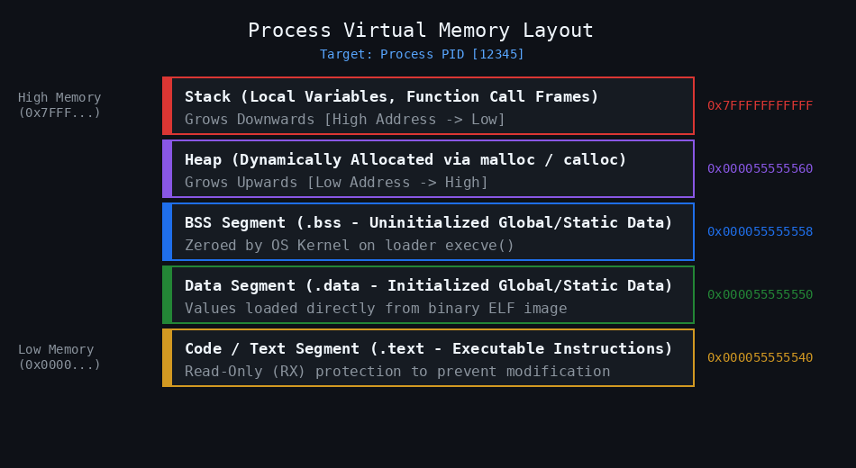
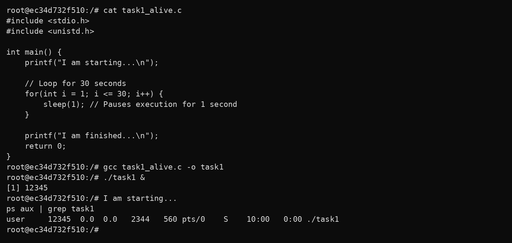
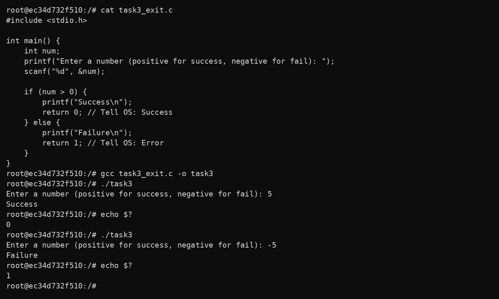
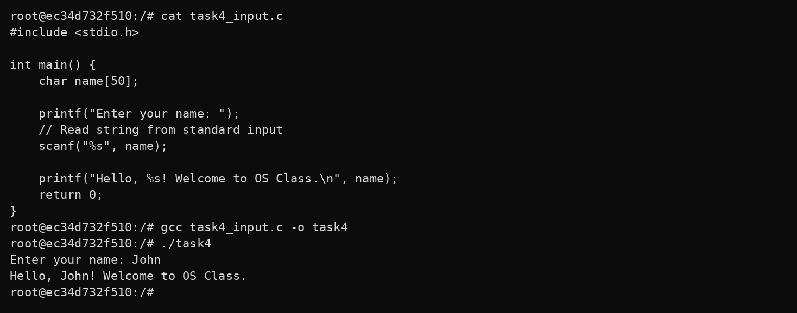

# Process Lifecycles & OS Interaction: Step-by-Step Guide

[]()
[]()
[]()
[](LICENSE)

The execution of a program in an operating system involves understanding process creation, memory segment allocation, execution state transitions, and kernel termination feedback. This document provides a practical, step-by-step demonstration of each phase, mapping directly to **Lecture 2 (A Process Layout & OS Loading)** and **Lab 3 (Investigating Process Lifecycles)**.

---

## Architecture Overview: A Process in Memory

```
                      [ Source Code: .c ]
                               │
                               │  gcc Compilation
                               ▼
                      [ Executable Binary: ELF ]
                               │
                               │  ./run (Shell fork + execve)
                               ▼
                    ┌───────────────────────────┐
                    │    PROCESS (PID in RAM)   │
                    │                           │
                    │ ◄── Keyboard (scanf)      │
                    │ ◄── OS Kernel (getpid)    │
                    │ ──► Screen (printf)       │
                    │ ──► Shell Exit Code ($?)  │
                    └───────────────────────────┘
```

### Memory Process Layout
When a process is created, the OS organizes memory into different sections:



* **Code/Text Segment**: Executable machine instructions (`R-X`).
* **Data Segment**: Initialized global and static variables.
* **BSS Segment**: Uninitialized global variables, zeroed by the kernel.
* **Heap**: Dynamic memory (`malloc`/`free`) growing upwards.
* **Stack**: Local variables, stack frames, and return pointers growing downwards.

---

## Step-by-Step Lab Tasks

### Task 1: The Long-Running Process

* **Objective**: In enterprise servers, processes run for days or months. We must know how to run a process in the background using `&` and monitor it while it is active using `ps aux`.
* **Command**: `cat task1_alive.c then gcc task1_alive.c -o task1 then ./task1 & then ps aux | grep task1`
* **Terminal Screenshot**:



* **Observation**: The `&` operator executes `./task1` in the background, freeing the terminal shell immediately with job ID `[1]` and PID `12345`. The `ps aux` command confirms the process is active in state `S` (**Interruptible Sleep**), paused during its `sleep(1)` loop without consuming unnecessary CPU cycles.

---

### Task 2: Process Identity (PID and PPID)

* **Objective**: Every process in Linux has a unique Process ID (`PID`). The process that created it is the Parent Process ID (`PPID`), usually your terminal shell. Query these using `getpid()` and `getppid()`, and verify them via `ps -p <PID> -o pid,ppid,cmd`.
* **Command**: `cat task2_identity.c then gcc task2_identity.c -o task2 then ./task2 & then ps -p 12345 -o pid,ppid,cmd`
* **Terminal Screenshot**:


* **Observation**: The program queries the Linux kernel and prints its unique `PID (12345)` and parent `PPID (8901)`. The OS `ps` command validates that the PPID `8901` belongs directly to the interactive terminal shell that spawned the process.

---

### Task 3: Exit Codes and OS Feedback ($?)

* **Objective**: When a program finishes, it returns an integer to the OS. `0` means "Success", and any non-zero number (like `1`) means "Error/Failure". The shell stores this in `$?`.
* **Command**: `cat task3_exit.c then gcc task3_exit.c -o task3 then ./task3 then echo $?`
* **Terminal Screenshot**:



* **Observation**: When given a positive input (`5`), the program returns `0`, and `echo $?` outputs `0` (**Success**). When given a negative input (`-5`), the program returns `1`, and `echo $?` outputs `1` (**Failure**), proving that Unix processes communicate execution status directly to the calling shell.

---

### Task 4: Standard I/O Streams

* **Objective**: The OS provides standard input (`stdin`, fd 0) and standard output (`stdout`, fd 1) streams. `scanf()` reads from `stdin`, and `printf()` writes to `stdout`.
* **Command**: `cat task4_input.c then gcc task4_input.c -o task4 then ./task4`
* **Terminal Screenshot**:



* **Observation**: The operating system connects the keyboard stream to `stdin`, which is read by `scanf()`, and redirects formatted text from `printf()` to `stdout` on the terminal screen.

---

### Task 5: Conditional Execution and Termination

* **Objective**: Programs often branch based on user input. The OS tracks the final exit code to determine if the script or automation pipeline should continue or halt.
* **Command**: `cat task5_control.c then gcc task5_control.c -o task5 then ./task5 then echo $?`
* **Terminal Screenshot**:


* **Observation**: Choosing `1` causes the process to continue, simulate workload (`sleep(5)`), and return exit code `0` (`Success`). Choosing `0` causes the process to immediately abort and return exit code `1` (`Failure`). Each independent run receives a newly allocated PID from the kernel (`12400` vs `12405`), illustrating process creation and destruction.

---

## 🛠️ Build and Execution Commands

```bash
# Compile all binaries into bin/
make all

# Build debug binaries with symbols for GDB
make debug

# Run interactive terminal menu
chmod +x scripts/menu.sh
./scripts/menu.sh

# Run automated tests and assertions
chmod +x scripts/test_exit_codes.sh
./scripts/test_exit_codes.sh

# Clean build artifacts
make clean
```

---

## 📚 Technical Documentation Directory
- [Comprehensive Lab 3 Technical Report](Lab3_Process_Lifecycles_Documentation.md)
- [Theory 1: Process Concept & Memory Segments](docs/01_theory_process_layout.md)
- [Theory 2: OS Program Loading (`fork` + `execve`)](docs/02_os_loading_and_execution.md)
- [Theory 3: Process Lifecycle, Termination, and Cleanup](docs/03_process_lifecycle_and_termination.md)
- [Theory 4: Linux `/proc` Virtual Filesystem Internals](docs/05_procfs_internals.md)
- [Theory 5: POSIX Signals & Asynchronous Interrupts Guide](docs/06_posix_signals_guide.md)
- [Lecture 2 Knowledge Assessment: All 15 Q&As](docs/04_knowledge_test_qa.md)

---

## 📄 License
Released under the [MIT License](LICENSE).
